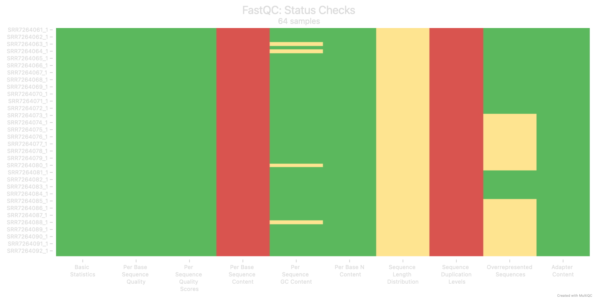
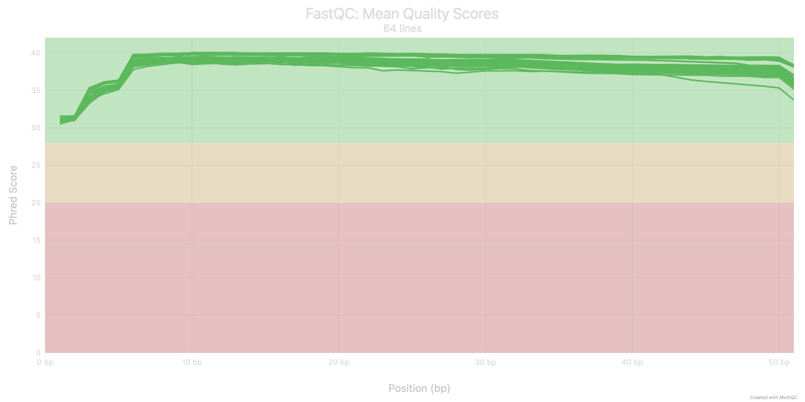
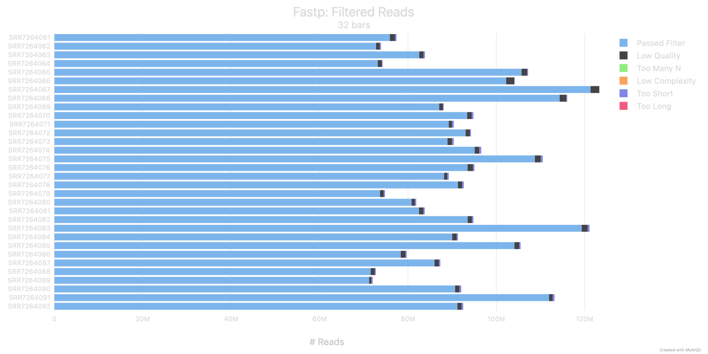
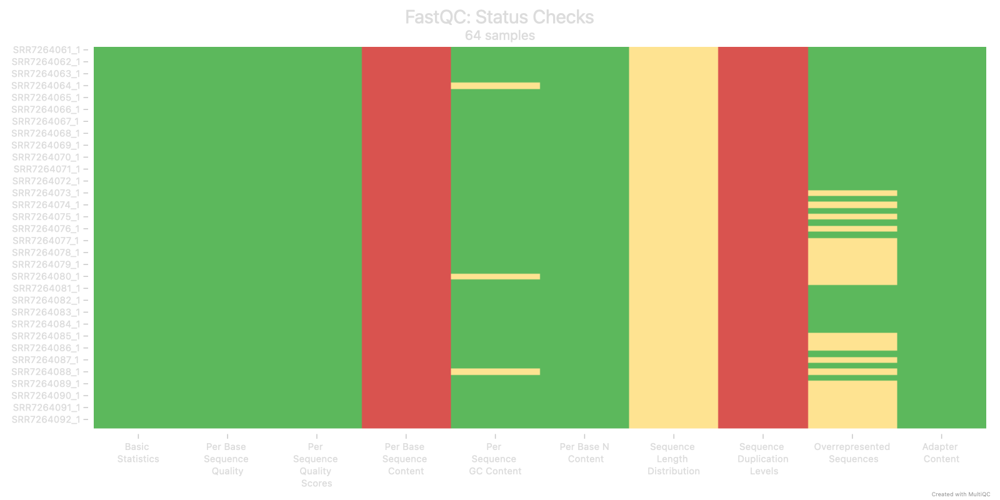
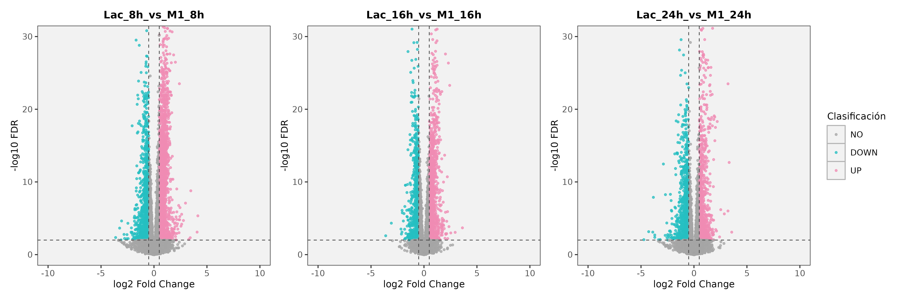

---
format:
  pdf:
    pdf-engine: xelatex
    documentclass: scrartcl
    papersize: letter

    toc: true
    toc-depth: 2
    number-sections: true

    fontsize: 12pt
    linestretch: 1.1
    mainfont: "Liberation Serif"
    monofont: "Liberation Mono"

    geometry:
      - left=2.5cm
      - right=2.5cm
      - top=2.5cm
      - bottom=2.5cm

    colorlinks: true
    linkcolor: black
    citecolor: black
    urlcolor: black

    syntax-highlighting: github
    code-block-bg: "#F5F5F5"

    fig-cap-location: bottom
    tbl-cap-location: bottom

execute:
  echo: true
  warning: false
  message: false

header-includes:
  - \setkomafont{title}{\LARGE\bfseries}
  - \setkomafont{subtitle}{\large\bfseries}
  - \usepackage{etoolbox}
  - \usepackage{ragged2e}
  - \usepackage{caption}
  - \AtBeginDocument{\justifying\setlength{\parindent}{0pt}\setlength{\parskip}{0.5em}}
  - \AtBeginEnvironment{Shaded}{\small}
  - \captionsetup[table]{position=bottom,skip=6pt}
  - \let\oldtableofcontents\tableofcontents
  - \renewcommand{\tableofcontents}{\begingroup\hypersetup{linkcolor=black}\oldtableofcontents\endgroup\clearpage}
---

# Introducción

El análisis de RNA-seq se ha consolidado como una estrategia central en transcriptómica, ya que permite cuantificar la expresión génica a escala genómica y comparar programas transcripcionales entre condiciones biológicas. En bioinformática, este tipo de análisis requiere un flujo reproducible que integre control de calidad, procesamiento de lecturas, alineamiento o cuantificación, normalización y análisis estadístico de expresión diferencial [1,2].

El objetivo de este proyecto fue aplicar un flujo completo de análisis de expresión diferencial a datos públicos de RNA-seq de ratón, desde la descarga y control de calidad de las lecturas hasta el alineamiento, la cuantificación génica, el análisis diferencial y la anotación funcional. Para ello, se seleccionó el dataset generado en el estudio `Metabolic regulation of gene expression by histone lactylation` [3], debido a que permite evaluar diferencias transcriptómicas asociadas con la polarización M1 de macrófagos y con la adición de ácido láctico. El análisis se realizó a partir de lecturas crudas paired-end y siguió el flujo revisado durante el curso. Se utilizaron FastQC y MultiQC para evaluar la calidad de las lecturas, fastp para aplicar una limpieza conservadora, STAR para el alineamiento contra el genoma de ratón mm39, featureCounts para obtener una matriz de conteos génicos, DESeq2 para el análisis de expresión diferencial y GO para la interpretación funcional.

## Contexto biológico del dataset seleccionado

El proyecto utiliza datos públicos de RNA-seq provenientes del estudio `Metabolic regulation of gene expression by histone lactylation` [3], en el cual los autores analizaron la relación entre metabolismo, lactato, modificaciones de histonas y regulación de la expresión génica en macrófagos de ratón. El interés central del estudio parte de que el lactato, aunque anteriormente se consideraba un producto final de la glucólisis, también puede tener funciones regulatorias no metabólicas, particularmente en contextos asociados con inflamación y reprogramación metabólica [3-8].

En este trabajo, los autores propusieron que el lactato puede actuar como precursor de la lactilación de lisinas en histonas, o histone lysine lactylation (Kla), una modificación postraduccional asociada con cambios en la transcripción génica desde la cromatina [3,7]. Para estudiar este proceso, utilizaron macrófagos derivados de médula ósea de ratón (bone marrow-derived macrophages, BMDM), estimulados con lipopolisacárido (LPS) e interferón gamma (IFNγ) para inducir polarización M1, un estado asociado con glucólisis aeróbica y mayor producción de lactato [6]. En este modelo, los autores observaron que el lactato aumenta principalmente en fases tardías de la activación y propusieron que la lactilación de histonas podría participar en la activación tardía de genes homeostáticos y de reparación, como `Arg1` [3,8].

El set de datos seleccionado corresponde a la serie GSE115354, disponible en Gene Expression Omnibus (GEO). Aunque esta serie incluye datos de ChIP-seq y RNA-seq, en este proyecto se trabajó únicamente con las muestras de RNA-seq. El diseño incluyó BMDM a 0 h, condiciones M1 a 4, 8, 16 y 24 h después de iniciar la estimulación con LPS e IFNγ, y condiciones M1 tratadas con ácido láctico a 8, 16 y 24 h. Cada condición cuenta con cuatro réplicas, por lo que el conjunto total analizado contiene 32 muestras paired-end.

# Metodología y resultados

## Filtrado de la metadata 

A partir de la metadata descargada desde *GEO* para la serie *GSE115354*, se realizó un proceso de limpieza y filtrado para conservar únicamente las muestras correspondientes a *RNA-seq*. Esta selección fue necesaria porque la serie original incluye dos tipos de ensayo: *RNA-seq* y *ChIP-seq*.

Para automatizar este paso, se desarrolló un script en *Python* que realiza tres tareas principales. Primero, estandariza los nombres de las columnas de la metadata original. Después, filtra las muestras cuyo campo `assay_type` corresponde a *RNA-seq*. Finalmente, genera dos archivos de salida: `samples_metadata.tsv`, que contiene la información relevante de las muestras seleccionadas, y `runs_to_download.txt`, que contiene la lista de accesiones *SRR* utilizadas posteriormente para la descarga de los archivos *FASTQ*. El script completo podrá consultarse en el repositorio con el nombre `01_filter_metadata.py`.

Como resultado de la ejecución, se seleccionaron 32 corridas de *RNA-seq paired-end*. Estas corridas se usaron como base para la descarga de 64 archivos *FASTQ* comprimidos, correspondientes a las lecturas R1 y R2 de cada muestra.

### Descarga de archivos FASTQ desde ENA

Después de generar la lista de accesiones SRR, los archivos *FASTQ* se descargaron desde *ENA* (*European Nucleotide Archive*), una base de datos pública que permite acceder a datos crudos de secuenciación. Se eligió *ENA* porque proporciona enlaces directos a archivos *FASTQ* comprimidos, lo que evita la conversión desde formato *SRA* y facilita la automatización de la descarga.

La descarga se realizó mediante un script en *Bash* que consulta la *API* de *ENA* para cada accesión contenida en `runs_to_download.txt`. Para cada corrida, el script recupera las rutas de descarga asociadas al campo `fastq_ftp`, separa los archivos correspondientes a lecturas *paired-end* y los descarga en una carpeta individual por accesión dentro de `02_data/raw_fastq`. Además, el script permite ejecutar varias descargas en paralelo mediante el parámetro `max_jobs` y verifica la integridad básica de cada archivo comprimido con `gzip -t`. El script completo puede consultarse en el repositorio con el nombre `03_download_ena.sh`.

Como resultado de la ejecución, se descargaron los archivos *FASTQ* correspondientes a las 32 corridas *paired-end* seleccionadas. Cada corrida quedó organizada en una carpeta independiente dentro de `02_data/raw_fastq`, con dos archivos comprimidos por muestra. En total, se obtuvieron 64 archivos *FASTQ* comprimidos. Después de la descarga, se verificó cada archivo con `gzip -t`; los archivos que presentaron errores de compresión se descargaron nuevamente antes de continuar con el control de calidad.

```{r}
#| label: tbl-diseno-rnaseq
#| echo: false
#| message: false
#| warning: false
#| tbl-cap: "Diseño experimental de las muestras de RNA-seq seleccionadas para el análisis."

library(tibble)
library(knitr)
library(kableExtra)

diseno_rnaseq <- tibble::tribble(
  ~Condicion, ~Tiempo, ~Tratamiento, ~Replicas,
  "M1", "0 h",  "LPS + IFNγ", 4,
  "M1", "4 h",  "LPS + IFNγ", 4,
  "M1", "8 h",  "LPS + IFNγ", 4,
  "M1", "16 h", "LPS + IFNγ", 4,
  "M1", "24 h", "LPS + IFNγ", 4,
  "M1 + lactato", "8 h",  "LPS + IFNγ + ácido láctico", 4,
  "M1 + lactato", "16 h", "LPS + IFNγ + ácido láctico", 4,
  "M1 + lactato", "24 h", "LPS + IFNγ + ácido láctico", 4
)

knitr::kable(
  diseno_rnaseq,
  col.names = c("Condición", "Tiempo", "Tratamiento", "Réplicas"),
  booktabs = TRUE,
  align = c("l", "c", "l", "c")
) %>%
  kableExtra::kable_styling(
    latex_options = c("hold_position"),
    full_width = FALSE,
    font_size = 8
  )
```


## Control de calidad de lecturas 

Antes del alineamiento, se evaluó la calidad de las lecturas crudas para determinar si era necesario aplicar un paso de limpieza. Para ello, se ejecutó *FastQC* sobre los 64 archivos *FASTQ* correspondientes a las 32 muestras *paired-end* seleccionadas y posteriormente se integraron los resultados con *MultiQC* [10]. El script completo utilizado para este paso se encuentra en el repositorio con el nombre `04_fastqc_raw_multiqc.sh`; en esta sección se muestran únicamente los comandos centrales y los parámetros principales del análisis.

De manera general, el script recorrió la lista de accesiones SRR, identificó los archivos R1 y R2 de cada muestra y ejecutó *FastQC* con 6 hilos. Posteriormente, *MultiQC* integró los reportes individuales en un único archivo *HTML* para facilitar la revisión global de la calidad de las lecturas. Los comandos centrales ejecutados dentro del script fueron los siguientes:

```{bash}
#| eval: false
#| echo: true

fastqc \
  -t "$threads" \
  -o "$fastqc_raw_dir" \
  "$r1" "$r2"

multiqc \
  "$fastqc_raw_dir" \
  -o "$multiqc_raw_dir" \
  -n "multiqc_raw_GSE115354.html"
```

En *FastQC*, el parámetro `-t` indica el número de hilos utilizados y `-o` define el directorio donde se guardan los reportes individuales. Los archivos `$r1` y `$r2` corresponden a las lecturas *paired-end* de cada muestra. En *MultiQC*, el primer argumento indica el directorio que contiene los reportes de *FastQC*, `-o` especifica el directorio de salida y `-n` define el nombre del reporte *HTML* final.

La revisión individual de los reportes de *FastQC* permitió identificar posibles muestras anormales o patrones que no fueran evidentes únicamente en el resumen global de *MultiQC*. Esta revisión confirmó que no había una muestra claramente problemática antes de aplicar el procesamiento posterior.

El resumen de *MultiQC* mostró que las lecturas presentaban buena calidad general. Los módulos más importantes para evaluar la calidad de las lecturas, como `Basic Statistics`, `Per base sequence quality`, `Per sequence quality scores`, `Per base N content` y `Adapter content`, mostraron resultados adecuados en la mayoría de los archivos. Particularmente, la calidad por base se mantuvo alta a lo largo de las lecturas y no mostró una caída marcada hacia el extremo 3’.
 


```{r}
#| label: fig-fastqc-raw-summary
#| echo: false
#| warning: false
#| message: false
#| fig-cap: "Resumen general de módulos FastQC en lecturas crudas. El gráfico permite identificar que los módulos de calidad general, contenido de N y adaptadores presentaron resultados adecuados, mientras que las principales advertencias se concentraron en módulos típicamente variables en RNA-seq."
#| out.width: "85%"
#| fig-align: "center"


```

Algunos módulos sí presentaron advertencias o fallos, principalmente `Per base sequence content`, `Sequence length distribution` y `Sequence duplication levels`. Sin embargo, el sesgo en `Per base sequence content` no se interpretó como evidencia directa de mala calidad, ya que en *RNA-seq* pueden observarse desviaciones en la composición de bases, especialmente al inicio de las lecturas, debido al tipo de biblioteca y a sesgos experimentales asociados con su preparación. De manera similar, los niveles altos de duplicación no necesariamente indican duplicación técnica, ya que en datos transcriptómicos los genes altamente expresados pueden generar muchas lecturas idénticas o muy similares [14].

```{r}
#| label: fig-fastqc-raw-per-base-quality
#| echo: false
#| warning: false
#| message: false
#| fig-cap: "Calidad por base de las lecturas crudas. La figura muestra que la calidad se mantuvo alta a lo largo de las lecturas, sin una disminución severa hacia el extremo final."
#| out.width: "85%"
#| fig-align: "center"


```

Con base en esta revisión, no se consideró necesario aplicar una limpieza agresiva. Sin embargo, se decidió realizar un procesamiento estándar con *fastp* para remover lecturas problemáticas, detectar posibles adaptadores y generar archivos limpios antes del alineamiento.

## Limpieza de lecturas con *fastp*

A partir de los resultados del control de calidad inicial, se decidió realizar un procesamiento conservador con *fastp* antes del alineamiento. El script completo utilizado para este paso se encuentra en el repositorio con el nombre `05_clean_reads.sh`.

De manera general, el script recorrió la lista de accesiones SRR, identificó los archivos R1 y R2 crudos de cada muestra, generó archivos *FASTQ* limpios y produjo reportes individuales en formato *HTML* y *JSON*. Después, los archivos procesados se evaluaron nuevamente con *FastQC*, y los resultados de *fastp* y *FastQC* se integraron en un reporte global de *MultiQC*.


```{bash}
#| eval: false
#| echo: true

fastp \
  -i "$r1" \
  -I "$r2" \
  -o "$clean_r1" \
  -O "$clean_r2" \
  --detect_adapter_for_pe \
  --qualified_quality_phred 20 \
  --unqualified_percent_limit 40 \
  --n_base_limit 5 \
  --length_required 35 \
  --thread "$threads" \
  --html "$html_report" \
  --json "$json_report"

fastqc \
  -t "$threads" \
  -o "$fastqc_clean_dir" \
  "$clean_r1" "$clean_r2"

multiqc \
  "$fastqc_clean_dir" \
  "$fastp_report_dir" \
  -o "$multiqc_clean_dir" \
  -n "multiqc_clean_GSE115354.html"
```

Los parámetros usados en *fastp* corresponden a una limpieza estándar. La opción `--detect_adapter_for_pe` permitió detectar adaptadores automáticamente en datos *paired-end*, mientras que `--qualified_quality_phred 20` definió Q20 como umbral mínimo para considerar una base como de buena calidad. Además, `--unqualified_percent_limit 40` permitió descartar lecturas con una proporción elevada de bases de baja calidad, `--n_base_limit 5` eliminó lecturas con exceso de bases no determinadas y `--length_required 35` conservó únicamente lecturas con una longitud mínima de 35 pb después del procesamiento.

El resultado de *fastp* mostró que la limpieza fue conservadora. En todas las muestras se retuvo más del 98% de las lecturas, lo que indica que la mayoría de las lecturas crudas ya presentaba calidad suficiente y que el procesamiento eliminó únicamente una fracción pequeña de lecturas problemáticas. En el resumen de lecturas filtradas, la mayor parte de las lecturas pasó los filtros de calidad.

```{r}
#| label: fig-fastp-filtered-reads
#| echo: false
#| warning: false
#| message: false
#| fig-cap: "Lecturas filtradas por fastp. La mayor parte de las lecturas pasó los filtros aplicados, lo que indica que no hubo una pérdida importante de datos."
#| out.width: "85%"
#| fig-align: "center"


```

Después de la limpieza, los resultados de *FastQC* integrados en *MultiQC* confirmaron que las lecturas mantuvieron buena calidad general. Los módulos relacionados con calidad por base, calidad promedio por secuencia, contenido de N y adaptadores mostraron resultados adecuados. En particular, el módulo de adaptadores pasó en todos los archivos, lo que indica que no quedó señal de contaminación por adaptadores después del procesamiento. La calidad por base se mantuvo alta a lo largo de las lecturas y no mostró una caída marcada hacia el extremo 3’.


```{r}
#| label: fig-fastqc-clean-summary
#| echo: false
#| warning: false
#| message: false
#| fig-cap: "Resumen de módulos FastQC después de la limpieza. Los módulos relacionados con calidad general, contenido de N y adaptadores mostraron resultados adecuados, mientras que las advertencias restantes se concentraron en módulos que pueden ser variables en datos de RNA-seq."
#| out.width: "85%"
#| fig-align: "center"


```


Estos resultados indican que la limpieza con *fastp* mejoró la calidad de las lecturas sin reducir de manera importante el tamaño del conjunto de datos antes de llevar a cabo el alineamiento.

## Alineamiento *paired-end* con *STAR*

Después de la limpieza de las lecturas, los archivos *FASTQ* procesados se utilizaron como entrada para el alineamiento contra el genoma de referencia de *Mus musculus* mm39, con anotación *GENCODE* vM36. Para esta etapa se utilizó *STAR* (*Spliced Transcripts Alignment to a Reference*), un alineador diseñado para datos de *RNA-seq* que permite mapear lecturas al genoma considerando la presencia de sitios de *splicing* [11].

La elección de *STAR* se basó en los resultados obtenidos en una actividad previa, donde se compararon diferentes estrategias de alineamiento y cuantificación. En esa comparación, *STAR* mostró porcentajes altos de alineamiento único y menor tiempo de ejecución que *HISAT2* en modo *paired-end*, aunque las métricas reportadas por ambas herramientas no son directamente equivalentes. Por esta razón, para el presente proyecto se decidió continuar únicamente con *STAR* como herramienta principal de alineamiento.

El alineamiento se realizó en modo *paired-end*, ya que las 32 muestras seleccionadas contaban con dos archivos *FASTQ* por corrida. El script completo se encuentra en el repositorio con el nombre `06_star_pe.sh`.


```{bash}
#| eval: false
#| echo: true

nohup bash 03_scripts/06_star_pe.sh \
  02_data/reference/index/mm39.gencode.M36.star \
  02_data/clean_fastq \
  04_results/06_star_pe \
  06_logs/star_pe \
  6 \
  > 06_logs/star_pe/nohup_star_pe.log 2>&1 &
```

En este comando, el primer argumento corresponde al directorio del índice de *STAR* para el genoma mm39 con anotación *GENCODE* vM36. El segundo argumento indica el directorio con las lecturas limpias, organizadas en carpetas por corrida SRR. El tercer argumento corresponde al directorio donde se guardaron los alineamientos, mientras que el cuarto indica la carpeta de logs. Por último, el valor `6` corresponde al número de hilos utilizados durante la ejecución.

Dentro del script, *STAR* recibe como entrada los archivos `${srr}_1.clean.fastq.gz` y `${srr}_2.clean.fastq.gz` de cada muestra. La opción `--runThreadN` define el número de hilos utilizados; `--genomeDir` indica la ubicación del índice de referencia; `--readFilesIn` especifica las lecturas *paired-end* de entrada y `--readFilesCommand zcat` permite leer directamente archivos comprimidos en formato `.gz`. Además, `--outFileNamePrefix` asigna el prefijo de salida para cada muestra y `--outSAMtype BAM SortedByCoordinate` permite generar directamente archivos *BAM* ordenados por coordenadas.

Para cada muestra también se generaron archivos de log estándar, log de error y reportes de tiempo y uso de recursos mediante `/usr/bin/time -v`, con el fin de monitorear la ejecución del alineamiento.

Además, a partir de los archivos `Log.final.out` generados por *STAR*, se extrajeron las métricas principales de alineamiento mediante un script incluido en el Anexo A6. Este resumen permitió evaluar de manera general el desempeño del alineamiento *paired-end* antes de continuar con la cuantificación génica.

```{r}
#| label: tbl-star-pe-summary
#| echo: false
#| message: false
#| warning: false
#| results: asis

library(readr)
library(knitr)
library(kableExtra)

star_summary <- read_tsv(
  "04_results/07_star_pe_stats/star_pe_summary.tsv",
  show_col_types = FALSE
)

knitr::kable(
  star_summary,
  col.names = c("Métrica", "Resultado"),
  caption = "Resumen general del alineamiento paired-end con STAR. Se muestran las métricas principales obtenidas a partir de los archivos Log.final.out generados por STAR.",
  booktabs = TRUE,
  align = c("l", "c"),
  escape = FALSE
) %>%
  kableExtra::kable_styling(
    latex_options = c("hold_position"),
    full_width = FALSE,
    font_size = 8
  )
``` 

En promedio, 87.64% de las lecturas se alinearon de manera única al genoma de referencia y 8.18% correspondió a lecturas multimapeadas. Esto indica un desempeño adecuado del alineamiento con *STAR*, ya que la mayor parte de las lecturas pudo asignarse a una posición única del genoma.

## Cuantificación génica con *featureCounts*

Una vez generados los archivos *BAM* resultantes del alineamiento, se procedió a la cuantificación de lecturas a nivel génico utilizando *featureCounts*, herramienta implementada en el paquete *Rsubread*. Esta herramienta permite asignar lecturas alineadas a características genómicas (*features*), como genes o exones, a partir de una anotación de referencia en formato *GTF* [12].

El script correspondiente a esta sección se encuentra en el repositorio con el nombre `09_featurecounts.R`.

```{r}
#| eval: false
#| echo: true

fc <- featureCounts(
  files = bam_files,
  nthreads = threads,
  annot.ext = gtf_file,
  isGTFAnnotationFile = TRUE,
  GTF.featureType = "exon",
  GTF.attrType = "gene_id",
  largestOverlap = TRUE,
  isPairedEnd = TRUE,
  requireBothEndsMapped = TRUE,
  strandSpecific = strand_value
)
```

La cuantificación se realizó con la anotación *GENCODE* vM36. En *featureCounts*, se indicó la ruta de la anotación con `annot.ext` y se especificó que correspondía a un archivo *GTF* con `isGTFAnnotationFile = TRUE`. Además, se usaron exones como unidad de asignación mediante `GTF.featureType = "exon"` y los conteos se agruparon por gen con `GTF.attrType = "gene_id"`.

Como los datos se procesaron en modo *paired-end*, se utilizó `isPairedEnd = TRUE` y `requireBothEndsMapped = TRUE`, de manera que solo se contaran fragmentos con ambos extremos alineados. No se aplicó un filtrado por *MAPQ* antes de la cuantificación; en su lugar, se usaron directamente los archivos *BAM* ordenados generados por *STAR*.

Antes de definir la cuantificación final, se evaluó el parámetro `strandSpecific`, que indica si la asignación de lecturas debe considerar la orientación de la cadena. Como no se asumió previamente el tipo de librería, el mismo script de *featureCounts*, incluido en el repositorio, se ejecutó con las tres configuraciones posibles: `0`, `1` y `2`.


```{r}
#| label: tbl-featurecounts-strand
#| echo: false
#| message: false
#| warning: false
#| results: asis

library(readr)
library(dplyr)
library(tibble)
library(knitr)
library(kableExtra)

get_counts <- function(file) {
  stats <- read_csv(file, show_col_types = FALSE)
  
  assigned <- stats %>%
    filter(Status == "Assigned") %>%
    select(-Status) %>%
    unlist() %>%
    as.numeric() %>%
    sum()
  
  no_features <- stats %>%
    filter(Status == "Unassigned_NoFeatures") %>%
    select(-Status) %>%
    unlist() %>%
    as.numeric() %>%
    sum()
  
  c(assigned, no_features)
}

strand_0 <- get_counts("04_results/08_featurecounts_strand_test/featurecounts_strand_0_stats.csv")
strand_1 <- get_counts("04_results/08_featurecounts_strand_test/featurecounts_strand_1_stats.csv")
strand_2 <- get_counts("04_results/08_featurecounts_strand_test/featurecounts_strand_2_stats.csv")

strand_table <- tibble(
  Categoría = c("Lecturas asignadas", "No asignadas (sin feature)"),
  `strandSpecific = 0` = strand_0,
  `strandSpecific = 1` = strand_1,
  `strandSpecific = 2` = strand_2
)

knitr::kable(
  strand_table,
  caption = "Resumen de las estadísticas de asignación de lecturas generadas por featureCounts para diferentes configuraciones del parámetro strandSpecific.",
  booktabs = TRUE,
  align = c("l", "r", "r", "r"),
  format.args = list(big.mark = ",", scientific = FALSE)
) %>%
  kableExtra::kable_styling(
    latex_options = c("hold_position"),
    full_width = FALSE,
    font_size = 8
  )
```

La comparación mostró que `strandSpecific = 2` produjo el mayor número de lecturas asignadas, mientras que `strandSpecific = 1` redujo la asignación y aumentó las lecturas clasificadas como `Unassigned_NoFeatures`. Por esta razón, la cuantificación final se realizó con `strandSpecific = 2`, lo que indica que las librerías presentan una orientación compatible con la configuración reversa de *featureCounts*.

La ejecución de *featureCounts* generó dos salidas principales: una matriz de conteos génicos (`fc$counts`), que se usó como base para el análisis de expresión diferencial, y una tabla de estadísticas de asignación (`fc$stat`), que fue útil para evaluar la eficiencia del conteo.

## Revisión preliminar del diseño experimental y definición de contrastes

Antes del análisis de expresión diferencial, se revisó la estructura de las muestras mediante un análisis de componentes principales (*PCA*). Para este paso se utilizó la matriz de conteos génicos obtenida con *featureCounts*, después del filtrado de genes con baja expresión y de la transformación de los conteos con *variance stabilizing transformation* (*VST*). Esta revisión permitió evaluar el agrupamiento entre réplicas y la separación entre condiciones experimentales.

La revisión preliminar de las muestras se realizó con el script `12_pca_dge.R`, disponible en el repositorio. Este script verificó la correspondencia entre la matriz de conteos y la metadata, filtró genes con baja expresión mediante `filterByExpr`, transformó los conteos con *VST* y generó el *PCA* utilizado para evaluar la estructura de las muestras antes del análisis diferencial.

El diseño experimental incluyó 32 muestras de macrófagos derivados de médula ósea de ratón (*bone marrow-derived macrophages*, BMDM), distribuidas en ocho condiciones con cuatro réplicas biológicas por grupo. Las condiciones correspondieron a BMDM en 0 h, macrófagos estimulados con LPS/IFNγ durante 4, 8, 16 y 24 h, y macrófagos estimulados con LPS/IFNγ en presencia de ácido láctico durante 8, 16 y 24 h.

```{r}
#| label: fig-pca-dge
#| echo: false
#| warning: false
#| message: false
#| fig-cap: "PCA de las muestras incluidas en el análisis de expresión diferencial. Los conteos génicos fueron transformados con VST después del filtrado de genes con baja expresión. El color representa la condición experimental."
#| out.width: "85%"
#| fig-align: "center"

knitr::include_graphics("05_figures/10_dge_qc/PCA_DGE_global.pdf")
```

El *PCA* mostró una separación clara entre las condiciones experimentales y un agrupamiento adecuado entre réplicas. Los dos primeros componentes explicaron 73.56% de la variación total, con 45.75% explicado por PC1 y 27.81% por PC2. Las muestras BMDM 0 h se separaron del resto principalmente en PC2, mientras que las condiciones estimuladas con LPS/IFNγ se distribuyeron de acuerdo con el tiempo. Además, las condiciones con ácido láctico mostraron separación respecto a sus controles M1, especialmente a 16 h y 24 h. Esta estructura sugiere que la variación global de los datos refleja principalmente la activación y el tiempo de estimulación, mientras que las diferencias asociadas con ácido láctico pueden depender del tiempo.

La metadata disponible no incluyó una variable técnica explícita, como placa, lote de preparación, carril de secuenciación o lote de librería. Por esta razón, no se incorporó una covariable de lote en el modelo. En su lugar, el análisis se centró en una variable combinada de condición, que integra el tiempo de estimulación y la presencia o ausencia de ácido láctico.

Dado que no todas las combinaciones entre tiempo y ácido láctico están presentes en el experimento, no se utilizó un modelo factorial completo con interacción entre tiempo y tratamiento. Se definió un modelo sin intercepto basado en la condición experimental:

Modelo principal: `design = ~ 0 + condition`

Este modelo permite estimar la expresión media de cada condición y construir contrastes directos entre grupos. Los contrastes principales se definieron entre las muestras tratadas con ácido láctico y sus controles M1 del mismo tiempo, con el objetivo de evaluar diferencias asociadas con la presencia de ácido láctico sin confundirlas con el tiempo de estimulación.

```{r}
#| label: tbl-contrastes-lactato
#| echo: false
#| message: false
#| warning: false
#| results: asis

library(tibble)
library(knitr)
library(kableExtra)

contrastes_lactato <- tibble(
  Razón = c(
    "Efecto del ácido láctico a 8 h",
    "Efecto del ácido láctico a 16 h",
    "Efecto del ácido láctico a 24 h"
  ),
  Contraste = c(
    "\\texttt{M1\\_Lac\\_8h - M1\\_8h}",
    "\\texttt{M1\\_Lac\\_16h - M1\\_16h}",
    "\\texttt{M1\\_Lac\\_24h - M1\\_24h}"
  ),
  Interpretación = c(
    "Cambios asociados al ácido láctico después de 8 h de estimulación",
    "Cambios asociados al ácido láctico después de 16 h de estimulación",
    "Cambios asociados al ácido láctico después de 24 h de estimulación"
  )
)

knitr::kable(
  contrastes_lactato,
  col.names = c("Razón", "Contraste", "Interpretación"),
  caption = "Contrastes principales utilizados para evaluar el efecto del ácido láctico en macrófagos estimulados con LPS/IFNγ.",
  booktabs = TRUE,
  align = c("l", "c", "l"),
  escape = FALSE
) %>%
  kableExtra::kable_styling(
    latex_options = c("hold_position"),
    full_width = FALSE,
    font_size = 8
  )
```

También se calcularon contrastes entre las condiciones M1 sin ácido láctico y la condición BMDM 0 h, con el propósito de describir la respuesta transcripcional inducida por LPS/IFNγ a lo largo del tiempo. Sin embargo, estos contrastes se consideraron solo como contexto biológico, ya que la pregunta central del proyecto se enfoca en el efecto asociado con la presencia de ácido láctico en macrófagos activados M1.

En todos los contrastes, los valores positivos de `log2FoldChange` indican mayor expresión en la condición ubicada en el numerador. Por ejemplo, en el contraste `M1_Lac_24h - M1_24h`, un valor positivo indica mayor expresión en las muestras tratadas con ácido láctico a 24 h, mientras que un valor negativo indica mayor expresión en las muestras M1 sin ácido láctico en el mismo tiempo.

## Análisis de expresión diferencial con *DESeq2*

A partir de la matriz de conteos génicos generada con *featureCounts*, se realizó el análisis de expresión diferencial con *DESeq2*. El análisis siguió el modelo definido en la revisión preliminar del diseño experimental:

Modelo: `design = ~ 0 + condition`

Este diseño permitió evaluar contrastes directos entre condiciones específicas. En primer lugar, se compararon las condiciones M1 contra BMDM 0 h, con el objetivo de describir la respuesta transcripcional general asociada con la activación inflamatoria inducida por LPS/IFNγ. Posteriormente, se evaluaron los contrastes principales del proyecto, correspondientes a las diferencias transcriptómicas asociadas con la adición de ácido láctico durante la polarización M1. Para esto, cada condición tratada con ácido láctico se comparó contra su control M1 del mismo tiempo: 8 h, 16 h y 24 h.

Antes del ajuste estadístico, el script `13_deseq2_dge.R` verificó la correspondencia entre la metadata y la matriz de conteos, y después filtró genes con baja expresión mediante `filterByExpr`. Este filtrado conservó 17,006 genes de los 78,239 genes presentes inicialmente en la matriz de conteos, por lo que 61,233 genes con baja evidencia de expresión quedaron fuera del análisis. Los genes diferencialmente expresados se clasificaron con los criterios `FDR < 0.01` y `|log2FoldChange| > 0.5`. Los genes con `log2FoldChange > 0.5` se clasificaron como UP, mientras que los genes con `log2FoldChange < -0.5` se clasificaron como DOWN.

```{r tbl-deseq2-summary, echo=FALSE, warning=FALSE, message=FALSE, results='asis'}
library(readr)
library(dplyr)
library(knitr)
library(kableExtra)

dge_summary <- read_csv(
  "04_results/11_deseq2_dge/dge_summary_by_contrast.csv",
  show_col_types = FALSE
) %>%
  mutate(
    contrast = gsub("_", "\\\\_", contrast)
  )

knitr::kable(
  dge_summary,
  col.names = c(
    "Contraste",
    "Genes evaluados",
    "Genes UP",
    "Genes DOWN",
    "DEGs totales"
  ),
  caption = "Resumen del análisis de expresión diferencial con DESeq2. Los genes UP y DOWN se definieron con FDR < 0.01 y |log2FoldChange| > 0.5.",
  booktabs = TRUE,
  align = c("l", "r", "r", "r", "r"),
  escape = FALSE
) %>%
  kableExtra::kable_styling(
    latex_options = c("hold_position"),
    full_width = FALSE,
    font_size = 8
  )

```

Los contrastes entre condiciones M1 y BMDM 0 h mostraron una respuesta transcriptómica asociada con la activación inflamatoria. El mayor número de genes diferencialmente expresados apareció a 4 h, con 9,973 DEGs, seguido por 8 h, con 9,149 DEGs. En los tiempos posteriores, el número total de genes diferenciales disminuyó a 7,484 en 16 h y 7,367 en 24 h. Esto indica que la activación con LPS/IFNγ produce una modificación extensa del transcriptoma desde tiempos tempranos y que esta diferencia persiste hasta 24 h, aunque con una menor cantidad de genes diferenciales.

En los contrastes asociados con la adición de ácido láctico, cada condición tratada se comparó contra su control M1 del mismo tiempo. El contraste `Lac_8h_vs_M1_8h` identificó 3,926 genes diferencialmente expresados, con 2,417 genes UP y 1,509 genes DOWN. A 16 h, el contraste `Lac_16h_vs_M1_16h` identificó 2,855 DEGs, con un mayor número de genes UP. A 24 h, el contraste `Lac_24h_vs_M1_24h` presentó 2,129 DEGs, con una distribución equilibrada entre genes UP y DOWN.

## Visualización de los contrastes asociados al ácido láctico

Para visualizar los cambios transcripcionales asociados con ácido láctico, se generaron *volcano plots* a partir del script `14_volcanoplot.R` para los tres contrastes principales. En estos gráficos, el eje X representa el `log2FoldChange`, mientras que el eje Y representa `-log10(FDR)`. Los puntos en rosa corresponden a genes UP, los puntos en turquesa corresponden a genes DOWN y los puntos en gris corresponden a genes que no cumplieron simultáneamente los criterios de significancia y tamaño de efecto. Las líneas punteadas indican los umbrales usados para clasificar genes diferencialmente expresados.

```{r}
#| label: fig-volcano-lactate
#| echo: false
#| warning: false
#| message: false
#| fig-cap: "Volcano plots de los contrastes asociados con la adición de ácido láctico en macrófagos M1. Los genes UP presentan mayor expresión en las condiciones con ácido láctico respecto al control M1 del mismo tiempo, mientras que los genes DOWN presentan menor expresión relativa. Las líneas punteadas indican los umbrales de |log2FoldChange| = 0.5 y FDR = 0.01."
#| out.width: "100%"
#| fig-align: "center"


```

Los volcano plots fueron consistentes con la tabla resumen del análisis diferencial. El contraste de 8 h mostró la mayor cantidad de genes significativos, tanto inducidos como reprimidos por el ácido láctico. A 16 h también se observó una señal diferencial alta, aunque menor que a 8 h. En 24 h, el número de genes diferencialmente expresados disminuyó, pero la presencia de genes significativos en ambos lados del gráfico indica que el ácido láctico todavía modifica la expresión génica en este tiempo.

Además de los volcano plots, se generó un heatmap con genes representativos de los contrastes de ácido láctico a partir del script `15_heatmap.R`. Para esta visualización se utilizaron conteos transformados con VST y posteriormente estandarizados por gen mediante Z score. Por esta razón, los colores no representan conteos crudos, sino expresión relativa dentro de cada gen. Los tonos rojos indican mayor expresión relativa y los tonos azules indican menor expresión relativa.

```{r}
#| label: fig-heatmap-lactate
#| echo: false
#| warning: false
#| message: false
#| fig-cap: "Heatmap de genes representativos asociados con la adición de ácido láctico en macrófagos M1. Los valores corresponden a conteos transformados con VST y estandarizados por gen como Z score. Las anotaciones superiores indican condición, tiempo y presencia o ausencia de ácido láctico."
#| out.width: "85%"
#| fig-align: "center"

knitr::include_graphics("05_figures/11_deseq2_dge/heatmap_top_lactate_genes.pdf")
```

El *heatmap* mostró patrones de expresión consistentes y permitió comparar directamente las condiciones M1 con y sin ácido láctico a 8 h, 16 h y 24 h. En varios grupos de genes se observó una diferencia clara entre las muestras tratadas con ácido láctico y sus controles M1 del mismo tiempo, lo cual coincide con los resultados observados en los *volcano plots*.

Debido a que el *heatmap* incluye genes seleccionados entre los más significativos de los contrastes de lactato, esta figura no representa el comportamiento global de todos los genes diferenciales, sino un resumen visual de genes representativos.

## Análisis de enriquecimiento funcional basado en *Gene Ontology*

*Gene Ontology* (*GO*) es una herramienta que proporciona una representación estructurada de la función de genes y productos génicos, incluyendo proteínas y RNAs no codificantes. Esta base organiza la información funcional en tres categorías principales: función molecular, componente celular y proceso biológico. La función molecular describe las actividades realizadas por los productos génicos; el componente celular indica las estructuras o localizaciones donde ocurren estas actividades; y el proceso biológico representa programas funcionales en los que múltiples actividades moleculares actúan de manera coordinada para producir un resultado biológico [13].

En este proyecto se utilizó únicamente la categoría de proceso biológico, ya que el objetivo principal fue interpretar qué programas celulares se asociaron con los genes diferencialmente expresados en respuesta a la adición de ácido láctico. No se incluyeron función molecular ni componente celular en el cuerpo principal del reporte para mantener el análisis enfocado en procesos biológicos y evitar una interpretación demasiado extensa.

Para preparar las entradas del análisis funcional se utilizó el script `16_prepare_files_go_.R`. Este script tomó como entrada los resultados completos de *DESeq2* para los contrastes `Lac_8h_vs_M1_8h`, `Lac_16h_vs_M1_16h` y `Lac_24h_vs_M1_24h`. Para cada contraste, el script separó los genes diferencialmente expresados en UP y DOWN usando los mismos criterios del análisis diferencial: `FDR < 0.01` y `|log2FoldChange| > 0.5`. Esta separación permitió distinguir procesos asociados con aumento o disminución relativa de expresión en presencia de ácido láctico.

El script también generó un archivo de background con los genes que pasaron el filtrado de baja expresión y que entraron al análisis de *DESeq2*. Este background se utilizó como universo de referencia para el enriquecimiento funcional, con el fin de comparar los genes diferencialmente expresados contra los genes que realmente tuvieron posibilidad de evaluarse en el análisis.

### Contraste Lac_8h_vs_M1_8h

Para el contraste `Lac_8h_vs_M1_8h`, el análisis *GO Biological Process* mostró patrones distintos entre genes UP y DOWN. En los genes UP, los términos enriquecidos se relacionaron principalmente con desarrollo, diferenciación celular, morfogénesis y neurogénesis. Aunque estos términos presentaron alta significancia, su interpretación debe ser cautelosa porque corresponden a categorías amplias y con una gran cantidad de genes. Por lo tanto, estos resultados sugieren una reorganización transcripcional general en presencia de ácido láctico, más que la activación específica de un programa neuronal en macrófagos.

En cambio, los genes DOWN mostraron términos más específicos y coherentes, asociados con traducción mitocondrial, expresión génica mitocondrial y ensamblaje de complejos de la cadena respiratoria, especialmente el complejo IV/citocromo c oxidasa. Debido a que estos genes presentan menor expresión en la condición con ácido láctico respecto al control M1 de 8 h, este resultado sugiere una reducción de procesos vinculados con función mitocondrial y ensamblaje de la cadena respiratoria.


```{r}
#| label: fig-go-bp-lac-8h
#| echo: false
#| warning: false
#| message: false
#| fig-cap: "Enriquecimiento funcional GO Biological Process para el contraste Lac_8h_vs_M1_8h. Se muestran por separado los términos enriquecidos en genes UP y DOWN. El tamaño del punto indica el número de genes asociados al término y el color representa la significancia como -log10(FDR)."
#| fig-subcap:
#|   - "Genes UP"
#|   - "Genes DOWN"
#| layout-ncol: 2
#| out-width: "100%"

knitr::include_graphics(c(
  "05_figures/12_go_bp/Lac_8h_vs_M1_8h_UP_BP.png",
  "05_figures/12_go_bp/Lac_8h_vs_M1_8h_DOWN_BP.png"
))
```

### Contraste Lac_16h_vs_M1_16h

Para el contraste `Lac_16h_vs_M1_16h`, los genes UP mostraron enriquecimiento en términos amplios relacionados con desarrollo de tejidos, morfogénesis, diferenciación celular y regulación de procesos celulares. Al igual que en el contraste de 8 h, estos términos deben interpretarse con cautela porque agrupan categorías generales y no indican necesariamente un programa de desarrollo específico en macrófagos.

Los genes DOWN mostraron un patrón funcional más específico, con enriquecimiento en síntesis de pseudouridina, modificación de RNA, procesamiento y metabolismo de tRNA, biogénesis ribosomal, traducción mitocondrial y expresión génica mitocondrial. Debido a que estos genes presentan menor expresión relativa en la condición con ácido láctico, el contraste sugiere una reducción de procesos asociados con maduración de RNA, biogénesis ribonucleoproteica y función mitocondrial a 16 h. 


```{r}
#| label: fig-go-bp-lac-16h
#| echo: false
#| warning: false
#| message: false
#| fig-cap: "Enriquecimiento funcional GO Biological Process para el contraste Lac_16h_vs_M1_16h. Se muestran por separado los términos enriquecidos en genes UP y DOWN. El tamaño del punto indica el número de genes asociados al término y el color representa la significancia como -log10(FDR)."
#| fig-subcap:
#|   - "Genes UP"
#|   - "Genes DOWN"
#| layout-ncol: 2
#| out-width: "100%"

knitr::include_graphics(c(
  "05_figures/12_go_bp/Lac_16h_vs_M1_16h_UP_BP.png",
  "05_figures/12_go_bp/Lac_16h_vs_M1_16h_DOWN_BP.png"
))
```

### Contraste Lac_24h_vs_M1_24h

Para el contraste `Lac_24h_vs_M1_24h`, los genes UP mostraron enriquecimiento en procesos relacionados con desarrollo vascular, proliferación celular, locomoción, muerte celular programada y apoptosis. Estos términos sugieren que, a 24 h, la adición de ácido láctico se asocia con cambios en genes vinculados con regulación celular, supervivencia y remodelación de respuestas celulares. 

Los genes DOWN mostraron enriquecimiento en procesos relacionados con replicación de DNA, metabolismo de glicina, metabolismo de compuestos con ácido fólico, biosíntesis de compuestos con nucleobases, metilación de macromoléculas, metabolismo de tRNA, biogénesis ribosomal y biogénesis de complejos ribonucleoproteicos. En comparación con los contrastes de 8 h y 16 h, este patrón conserva la reducción de procesos asociados con RNA, ribosomas y metabolismo de nucleótidos, aunque a 24 h también aparecen términos vinculados con replicación y biosíntesis.


```{r}
#| label: fig-go-bp-lac-24h
#| echo: false
#| warning: false
#| message: false
#| fig-cap: "Enriquecimiento funcional GO Biological Process para el contraste Lac_24h_vs_M1_24h. Se muestran por separado los términos enriquecidos en genes UP y DOWN. El tamaño del punto indica el número de genes asociados al término y el color representa la significancia como -log10(FDR)."
#| fig-subcap:
#|   - "Genes UP"
#|   - "Genes DOWN"
#| layout-ncol: 2
#| out-width: "100%"

knitr::include_graphics(c(
  "05_figures/12_go_bp/Lac_24h_vs_M1_24h_UP_BP.png",
  "05_figures/12_go_bp/Lac_24h_vs_M1_24h_DOWN_BP.png"
))
```

En general, en los tres contrastes evaluados, los genes UP mostraron enriquecimiento en procesos amplios de regulación celular, diferenciación, proliferación y muerte celular;en cambio, los genes DOWN mostraron patrones más consistentes entre tiempos, principalmente asociados con traducción mitocondrial, expresión génica mitocondrial, biogénesis ribosomal, modificación de RNA y metabolismo de tRNA. En conjunto, estos resultados sugieren que la adición de ácido láctico se asocia con cambios funcionales amplios, con una señal recurrente de disminución en procesos relacionados con mitocondria y metabolismo de RNA.


# Discusión y conclusiones

Los resultados sugieren que las condiciones con ácido láctico presentan un estado transcripcional distinto al de sus controles M1 del mismo tiempo. Esta comparación permitió reducir la confusión con la activación inflamatoria general inducida por LPS/IFNγ, ya que cada contraste comparó muestras con el mismo tiempo de estimulación. La disminución progresiva en el número de genes diferenciales de 8 h a 24 h podría indicar que la diferencia asociada al ácido láctico resulta más evidente en etapas tempranas, mientras que en tiempos tardíos los macrófagos M1 ya presentan una reprogramación metabólica e inflamatoria avanzada.

La anotación funcional mostró que los genes con mayor expresión relativa en las condiciones con ácido láctico se relacionaron con procesos amplios de regulación celular, diferenciación, proliferación y muerte celular. Estos términos no indican necesariamente la activación literal de programas de desarrollo en macrófagos, sino cambios generales en genes reguladores. En cambio, los genes con menor expresión relativa mostraron un patrón más consistente, asociado con función mitocondrial, traducción, biogénesis ribosomal y metabolismo de RNA. Esto sugiere una reorganización funcional del transcriptoma, con una señal recurrente en procesos mitocondriales y de metabolismo de RNA.

Estos patrones son compatibles con la idea de que el lactato puede participar en la regulación transcripcional durante la activación M1. Sin embargo, este análisis solo permite describir asociaciones entre la condición experimental y la expresión génica; no demuestra que los cambios dependan directamente de lactilación de histonas ni establece causalidad mecanística. Para comprobar ese mecanismo harían falta datos epigenómicos, como ChIP-seq, o validaciones dirigidas de marcas de lactilación.

En conclusión, el proyecto permitió identificar diferencias transcriptómicas asociadas con la presencia de ácido láctico en macrófagos M1 y proponer hipótesis sobre su relación con cambios en el estado celular. Las herramientas bioinformáticas fueron esenciales para construir esta interpretación: STAR permitió obtener alineamientos confiables, `featureCounts` generó la matriz de conteos, DESeq2 identificó genes diferencialmente expresados y GO ayudó a interpretar esos cambios como procesos biológicos coordinados.

# Reproducibilidad

El análisis se organizó como un flujo de trabajo reproducible con carpetas separadas para metadata, datos crudos, datos procesados, scripts, resultados, figuras y logs. Los scripts se numeraron de acuerdo con el orden del análisis, desde el filtrado de metadata y la descarga de archivos *FASTQ* hasta el control de calidad, limpieza, alineamiento, cuantificación génica, análisis de expresión diferencial y enriquecimiento funcional.

Los datos de entrada correspondieron a muestras públicas de *RNA-seq paired-end* de la serie `GSE115354`. Las lecturas se descargaron desde *ENA* a partir de accesiones *SRR*. Para el alineamiento se utilizó el genoma de referencia de *Mus musculus* mm39 y la anotación *GENCODE* vM36 en formato *GTF*. La cuantificación génica se realizó con los archivos *BAM* ordenados generados por *STAR*.

Los parámetros principales del flujo también se documentaron para facilitar la reproducción del análisis. La limpieza con *fastp* incluyó detección automática de adaptadores para datos *paired-end*, calidad mínima Q20, límite de 40% de bases de baja calidad, máximo de 5 bases N y longitud mínima de 35 pb. El alineamiento con *STAR* se realizó con 6 hilos, lectura directa de archivos `.gz` mediante `zcat` y salida en formato *BAM* ordenado por coordenadas. La cuantificación con *featureCounts* utilizó `isPairedEnd = TRUE`, `requireBothEndsMapped = TRUE`, `GTF.featureType = "exon"`, `GTF.attrType = "gene_id"` y `strandSpecific = 2`.

El análisis de expresión diferencial se realizó en *R* con *DESeq2*. Antes del ajuste estadístico, los genes con baja expresión se filtraron con `filterByExpr`. El modelo utilizado fue `design = ~ 0 + condition`, y los genes diferencialmente expresados se definieron con `FDR < 0.01` y `|log2FoldChange| > 0.5`. Para el análisis funcional se utilizaron por separado los genes UP y DOWN de los contrastes asociados con ácido láctico. El enriquecimiento se enfocó en *GO Biological Process* y utilizó como universo de referencia los genes conservados después del filtrado de baja expresión.

El análisis se ejecutó en el servidor `chaac.lcg.unam.mx`, dentro del directorio de trabajo `/export/space3/users/alondram/GENOMICAS/4to_sem/Transcriptomica_26/02_proyecto`. Para documentar el entorno computacional, se registraron la fecha de ejecución, el sistema operativo, las versiones principales de software y las versiones de los paquetes de *R*. La salida completa de estos comandos, junto con los scripts personalizados, tablas completas de resultados y figuras complementarias, se encuentra disponible en el repositorio del proyecto: [Repositorio del proyecto](ENLACE_AL_REPOSITORIO).


```{r}
#| label: tbl-software-versions
#| echo: false
#| message: false
#| warning: false
#| results: asis

library(tibble)
library(knitr)
library(kableExtra)

software_versions <- tibble(
  Herramienta = c(
    "Sistema operativo",
    "Bash",
    "Python",
    "R",
    "FastQC",
    "MultiQC",
    "gzip",
    "fastp",
    "STAR"
  ),
  Versión = c(
    "Linux 5.14.0-654.el9.x86_64",
    "GNU bash 5.1.8",
    "Python 3.10.18",
    "R 4.3.3",
    "FastQC v0.12.1",
    "MultiQC 1.33",
    "gzip 1.12",
    "fastp 0.24.1",
    "STAR 2.7.11b"
  )
)

knitr::kable(
  software_versions,
  col.names = c("Herramienta", "Versión registrada"),
  caption = "Versiones principales de software registradas durante la documentación del entorno computacional.",
  booktabs = TRUE,
  align = c("l", "l")
) %>%
  kableExtra::kable_styling(
    latex_options = c("hold_position"),
    full_width = FALSE,
    font_size = 8
  )
```

```{r}
#| label: tbl-r-package-versions
#| echo: false
#| message: false
#| warning: false
#| results: asis

library(tibble)
library(knitr)
library(kableExtra)

r_packages <- tibble(
  Paquete = c(
    "Rsubread",
    "DESeq2",
    "edgeR",
    "ggplot2",
    "readr",
    "dplyr",
    "tibble",
    "knitr",
    "kableExtra",
    "patchwork",
    "ComplexHeatmap",
    "circlize"
  ),
  Versión = c(
    "2.16.1",
    "1.42.1",
    "4.0.16",
    "4.0.3",
    "2.1.5",
    "1.1.4",
    "3.2.1",
    "1.45",
    "1.4.0",
    "1.3.2",
    "2.18.0",
    "0.4.18"
  )
)

knitr::kable(
  r_packages,
  col.names = c("Paquete de R", "Versión"),
  caption = "Versiones de los paquetes de R utilizados para cuantificación, análisis diferencial, visualización y generación del reporte.",
  booktabs = TRUE,
  align = c("l", "c")
) %>%
  kableExtra::kable_styling(
    latex_options = c("hold_position"),
    full_width = FALSE,
    font_size = 8
  )
```


# Referencias

1. Wang Z, Gerstein M, Snyder M. RNA-Seq: a revolutionary tool for transcriptomics. Nat Rev Genet. 2009;10(1):57-63. doi:10.1038/nrg2484.

2. Conesa A, Madrigal P, Tarazona S, Gomez-Cabrero D, Cervera A, McPherson A, et al. A survey of best practices for RNA-seq data analysis. Genome Biol. 2016;17:13. doi:10.1186/s13059-016-0881-8.

3. Zhang D, Tang Z, Huang H, Zhou G, Cui C, Weng Y, et al. Metabolic regulation of gene expression by histone lactylation. Nature. 2019;574(7779):575-80. doi:10.1038/s41586-019-1678-1.

4. Haas R, Cucchi D, Smith J, Pucino V, Macdougall CE, Mauro C. Intermediates of metabolism: from bystanders to signalling molecules. Trends Biochem Sci. 2016;41(5):460-71. doi:10.1016/j.tibs.2016.02.003.

5. Palsson-McDermott EM, O’Neill LAJ. The Warburg effect then and now: from cancer to inflammatory diseases. Bioessays. 2013;35(11):965-73.

6. Galván-Peña S, O’Neill LAJ. Metabolic reprograming in macrophage polarization. Front Immunol. 2014;5:420.

7. Kaelin WG Jr, McKnight SL. Influence of metabolism on epigenetics and disease. Cell. 2013;153(1):56-69.

8. Rath M, Müller I, Kropf P, Closs EI, Munder M. Metabolism via arginase or nitric oxide synthase: two competing arginine pathways in macrophages. Front Immunol. 2014;5:532.

9. Leinonen R, Akhtar R, Birney E, Bower L, Cerdeno-Tárraga A, Cheng Y, et al. The European Nucleotide Archive. Nucleic Acids Res. 2011;39(Database issue):D28-31. doi:10.1093/nar/gkq967.

10. Ewels P, Magnusson M, Lundin S, Käller M. MultiQC: summarize analysis results for multiple tools and samples in a single report. Bioinformatics. 2016;32(19):3047-8. doi:10.1093/bioinformatics/btw354.

11. Dobin A, Davis CA, Schlesinger F, Drenkow J, Zaleski C, Jha S, et al. STAR: ultrafast universal RNA-seq aligner. Bioinformatics. 2013;29(1):15-21. doi:10.1093/bioinformatics/bts635.

12. Liao Y, Smyth GK, Shi W. featureCounts: an efficient general purpose program for assigning sequence reads to genomic features. Bioinformatics. 2014;30(7):923-30. doi:10.1093/bioinformatics/btt656.

13. Gene Ontology Consortium. The Gene Ontology knowledgebase in 2023. Genetics. 2023;224(1):iyad031. doi:10.1093/genetics/iyad031.

